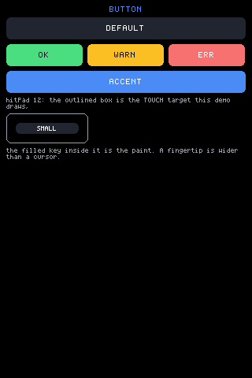
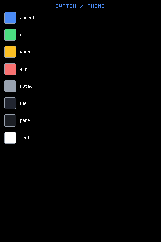
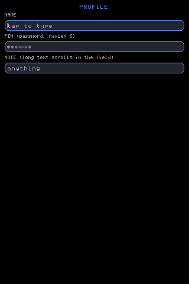
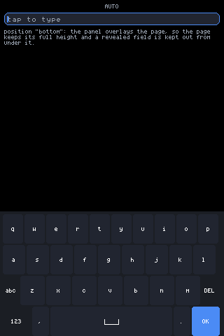

# Ready-made components

Everything here lives in `packages/core/src/mjsx.js` and is built from the
same primitives (`box`, `row`, `text`, `abs`) any app uses — none of it is
mandatory, and any of it can be rebuilt in app code when it doesn't fit.
Snippets below are lifted from `examples/`.

## Button

A rounded box with a centred label. Everything is a prop with a sane
default: `bg` (theme key colour), `pad` (`em(1.25)`), `size` (2 — pass
`size` yourself, the label defaults large), plus `w`/`h`, `color`,
`hitPad`, and the full tap family: `onTap`, `onLongPress`, `onHold` with
`holdEvery` for auto-repeat.

From `examples/counter/app.jsx`:

```jsx
<Button label="+1" size={2}
        onTap={function () { UI.set({ count: count + 1 }); }} />
```



## Swatch

A colour chip: a bordered, rounded square filled with `color`. That is the
whole component —

```jsx
<Swatch color={0x4b8bf5} size={22} />
```

— which is the point of it being here rather than in your app: it is four
lines in `mjsx.js`, and it exists so a palette is written as a palette
rather than as a row of hand-rolled boxes.

- **`color`**: the fill. Required; there is no default.
- **`size`**: side length in pixels, default 24. Width and height are the
  same, so a swatch is always square.

The border is `UI.theme.muted`, which is what keeps a dark swatch visible
on a dark panel. `examples/canvas` and `examples/draw` build their palettes
out of these, and put them on the rim through `ArcFooter` on round glass.



## Modal

A centred overlay panel, opened with `UI.openModal`:

```jsx
UI.openModal(function () {
  return h(Modal, { header: <text text="SETTINGS" size={2} align="center" /> },
    <text text="…" wrap={true} />,
    <Button label="CLOSE" onTap={function () { UI.closeModal(); }} />);
});
```

**The margins are minimums, not a size.** While the content fits, the panel
is only as tall as it needs to be and centres vertically in what is left.
When the content would not fit inside those margins, the panel pins to the
available height and its *content* scrolls instead — and `header` and
`footer`, if given, stay put above and below that scroll. So the same modal
is a small centred card on a 3.5" panel and a full-height scrolling sheet
on a 1.28" round one, with nothing to configure per shape.

- **`margin`**: minimum gap to the screen edge, default `em(1.5)`.
- **`header`** / **`footer`**: nodes that stay sticky when the content
  scrolls. Omit them and the whole panel scrolls as one.
- **`gap`**: between children, default `em(0.75)`.
- **`scroll`**: the scroll zone's id, default `'_modal'` — name it if two
  modals must keep separate scroll positions.
- **`bg`**, **`border`**, **`borderW`**, **`radius`**, **`pad`**: the
  panel's own box, defaulting to the theme's panel colour, the accent as a
  2px border, radius 10 and `em(1)` of padding.


## input

A single-line text field. The engine owns the editing state per `id` —
text (when uncontrolled), caret, horizontal scroll — so the app's render
stays a pure description; passing `value` makes it controlled. Tap
focuses and places the caret, a drag scrolls overflowing text, and
press-and-hold then drag walks the caret under the finger. The caret
blinks; `password` masks with `*`; `placeholder` shows muted when empty;
`maxLen` caps length; Enter fires `onSubmit(text)` and blurs, Escape
blurs, and edits fire `onChange`.

Keys reach the focused field from *any* keyboard — physical, the built-in
`Keyboard` layouts, a host's native one, or an app's own JSX — because
they all travel as `UI.key('press', name)` (or `UI.type("...")` for
literal text). Tab and the vertical arrows walk the focus order, and a
field below the fold is scrolled into view when reached.

`exclusive` asks the virtual keyboard to take the whole display while
this field has focus (see Keyboard below). `focusable={false}` keeps a
field out of the focus order.

From `examples/input/app.jsx`:

```jsx
<input id={p.id} size={p.size || 2} placeholder={p.placeholder}
       password={p.password} maxLen={p.maxLen}
       label={p.label} exclusive={p.exclusive}
       onSubmit={function (v) { UI.set({ last: p.label + ': ' + v }); }} />
```



## Keyboard

A virtual keyboard, drawn as plain JSX over ordinary boxes. Which is also
the whole story for a *custom* keyboard: build any view whose taps call
`UI.key('press', name)` or `UI.type("...")` and it is a keyboard, with
nothing to register — `examples/input/app.jsx`'s `PinPad` does exactly
that.

```jsx
h(Keyboard, { layout: kb, position: pos,
              height: Math.floor(gfx.height() / 2.6) })
```



Props and behaviour, all from the source:

- **`layout`**: `'auto'` (default), `'qwerty'`, `'t9'`, `'numbers'`,
  `'strip'`. `'auto'` fits the layout to the glass: QWERTY where ten
  columns of ~22px fit (≥220px), T9 where four of ~28px do (≥115px),
  STRIP's single scrolling row below that. **A named layout is honoured
  exactly, however cramped** — a stated preference is a decision, not a
  suggestion.
  The width that decides is the width the keys actually get: on round
  glass that is the chord down where the bottom rows sit, not the
  bounding box (a 240px circle measures 240 across the middle and only
  154 down there).
- **Round glass**: each key row is inset to the chord at its own height,
  so a keyboard is a trapezoid and the outermost keys stay on the glass
  instead of under the bezel. In exclusive mode the mirrored input is
  pushed a tenth of the display down, off the narrow top arc, the keys
  stop short of the bottom arc, and OK moves into that arc — space the
  grid could never use, so it costs the keyboard no height.
- **The space bar** carries the `␣` mark (a rule with turned-up ends,
  drawn from lines rather than spelled) and is given its width from
  whatever the bottom row has left. Where a row cannot hold everything,
  the punctuation keys drop out — labels are never abbreviated.
- **`height`** is a hint for the whole keyboard: keys scale to fit it
  given the layout's row count (strip has 2 rows, everything else 4 —
  T9 and the number pad put OK on their utility row rather than spending
  a whole row of height on it). `keyH` sets one key's height directly
  instead.
- **`position`**: `'inline'` (default — flows like any child),
  `'bottom'` or `'top'` (an overlay pinned to that screen edge, taking no
  flow space; it registers an inset so scroll-into-view keeps a revealed
  field out from under it). The panel is a `shield`: a press between keys
  dies there instead of falling through to what the overlay covers, and a
  docked panel runs flush to its screen edge so the outer row owns edge
  presses.
- **Auto-exclusive**: if the docked keys would come out under 30px,
  docking is a fiction — the keyboard takes the whole display instead,
  exactly as an input's `exclusive` prop would, with a mirror of the
  focused input above the keys (input state is keyed by `id`, so the
  mirror *is* the field — same text, same caret) and an `x` key that
  sends Escape. A short landscape display (172px glass) hits this on
  every layout.
- **Shift is shift-once**, phone style: one uppercase character, then it
  clears. On T9 it survives multi-tap cycling and clears when the cycle
  commits.
- **QWERTY symbol pages**: `123` flips to numbers and symbols, `#+=` to a
  second page, so every glyph the face carries is typeable — brackets,
  backslash, pipe, tilde, backtick.
- **T9 is letters-first**: each key face shows its letters large with the
  digit as a small hint below. Tapping the same key again within the
  window cycles its characters (a Backspace then the next character,
  through the normal editing path, so it works on any focused input).
  *Hold* a key for its digit, phone style. A long press of `abc` opens a
  symbol pad whose keys multi-tap through themed sets; the space key
  cycles space → `@` → `-` → `0`.
- **Strip** is a single scrolling row of characters for displays with no
  room for a grid: drag to scroll, tap to type, long-press `abc` for the
  symbol strip.

## ArcFooter

Controls along the *edge* of the glass, whatever its shape. Each item
sits where the ray from screen-centre at its angle meets the boundary,
pulled inward by the item's own size — on round glass the boundary is the
rim, on square glass the rectangle's perimeter, so a bottom arc becomes
the bottom edge, a wide one spills around the corners onto the sides, and
the same call serves every shape. Items stay upright — only their
positions follow the edge.

- **`items`**: `[{ w, h, node }]` — finished elements; `w`/`h` centre
  each one on its boundary point without measuring.
- **`at`**: centre angle in degrees; 90 = bottom (the default), 270 =
  top, 0 = right, 180 = left.
- **`spread`**: total sweep in degrees (default 120).
- **`inset`**: margin from the boundary (default 10 round, 8 square).

Put wide items mid-list where a round boundary is generous; angles that
cluster at a square's corner can overlap, so keep spread and count sane.

From `examples/canvas/app.jsx` and `examples/draw/app.jsx`, which move
their toolbars onto the rim when `UI.isRound()`:

```jsx
var items = [];
items.push({ w: 34, h: 22, node:
  <Button label="CLR" size={1} pad={em(0.25)} h={22} w={34} color={0xdd6644}
          onTap={function () { UI.set({ strokes: [] }); }} /> });
// ... colour swatches, each { w: 22, h: 22, node: <box .../> } ...
{h(ArcFooter, { items: items, spread: 150, inset: 10 })}
```


