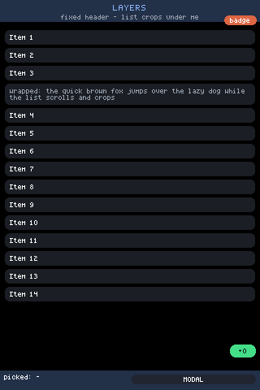
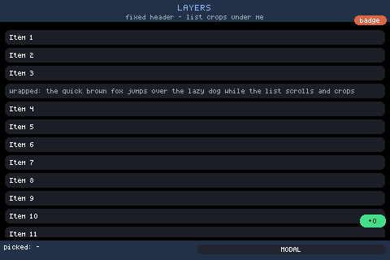
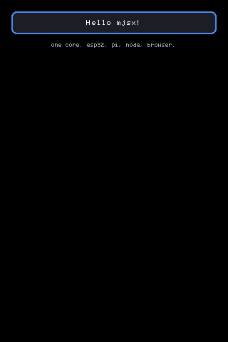
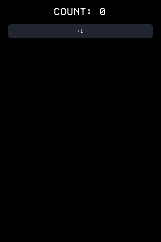
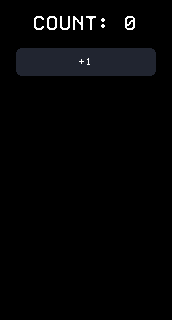
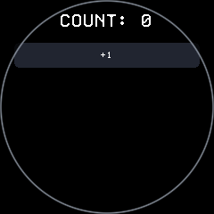
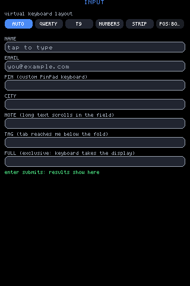

# Getting started

Sixty seconds from a clone to a UI you wrote, and a few minutes more to
that same file running on real glass. Everything here runs with
[bun](https://bun.sh); there are no required dependencies, and nothing
below needs a device until the last step.

## 1. Install, and run an example

```
bun install
```

That is the whole install. SDL2 is the only native dependency in the repo
and it is optional — the window sim asks for it, nothing else does.

The fastest look at the engine is the example picker, which renders into
your terminal (arrow keys move a cursor, Enter taps, Esc backs out to the
menu, q quits):

```
bun run examples
```



*`examples/layers`, one of the fourteen the picker offers. The header,
the `badge` over its right end, the floating `+0` and the footer all stay
put; the list crops between them. Shown here rendered headlessly at
320x480 — the terminal draws the same frame with half-block cells, at
whatever size your window is.*

For a window that looks like the hardware — plus a live browser mirror at
`http://localhost:8080` — use the CLI's dev command:

```
bun packages/cli/bin/mjsx.js dev counter
```



*The same example in a 480x320 desktop window. There is no file watcher:
the sim re-reads an example from disk each time it loads one, so after an
edit press RESTART in its toolbar (or Esc, then pick it again).*

Two things worth knowing early: `mjsx dev` loads the **bundled examples
only** — it takes a name (`counter`) or a path inside `examples/` — and
the sim's `--circle` flag is a window mask, so it previews round glass
while the app still lays out square. Whether the glass is round is a fact
the *host* declares (`configStorage`'s `round` key, which `UI.isRound()`
reads once and caches); nothing in `backends/` writes it. See
[round.md](round.md) and [contract.md](contract.md).

And with no terminal and no window at all, the headless runner writes a
frame to a file:

```
bun run example:hello              # -> out/hello.ppm, 240x280
bun run example:counter            # -> out/counter.ppm, and a second frame
```

`example:counter` writes two: the example exports a `demo()` the runner
drives, so it prints `simulated tap at ... -> count is now 1` and writes
`out/counter.after.ppm` beside the first. That is the round trip — state,
`UI.set`, redraw — proven without a finger.

`out/` is gitignored, so a fresh clone may not have it. Neither of these
creates a directory; both write exactly the path they are given.

## 2. Your first app

A complete mjsx app is one flat `app.jsx` file with no imports. `h`, `UI`,
`em` and the components are ambient globals, because that is what a device
hands a script. Save this as `app.jsx` anywhere:

```jsx
function App() {
  return (
    <box pad={em(2)} gap={em(1.5)}>
      <box bg={UI.theme.panel} radius={8} border={UI.theme.accent} borderW={2}
           pad={em(1.5)}>
        <text text="Hello mjsx!" size={2} color={UI.theme.text} align="center" />
      </box>
      <text text="one core. esp32, pi, node, browser." size={1}
            color={UI.theme.muted} align="center" wrap={true} />
    </box>
  );
}

UI.mount(App);
```

Thirteen lines of code, and it is `examples/hello/app.jsx` with its
comment header removed. Run it:

```
bun packages/cli/bin/mjsx.js run app.jsx                        # into this terminal
bun packages/cli/bin/mjsx.js run app.jsx --ppm app.ppm --size 320x480
```



*What that file draws, at 320x480: the outer `box` pads the screen, the
inner one paints the panel colour with a 2px accent border and an 8px
radius, and the two `text` lines centre inside it. Nothing is positioned
in pixels — `em(2)` is two line-heights of whatever font the host draws
with.*

Unlike `mjsx dev`, `mjsx run` takes any path, so this is the loop for
your own files. `--ppm` writes exactly the path you give it and does not
create directories; it fails early and says so if the directory is
missing.

## 3. Make it respond

There is no reconciler and no retained tree. A handler calls `UI.set`,
which shallow-merges into `UI.state` and marks the frame dirty, and the
next render redraws everything. That is the entire model:

```jsx
function App() {
  var count = UI.state.count || 0;
  return (
    <box pad={em(2)} gap={em(2)}>
      <text text={'COUNT: ' + count} size={3} color={UI.theme.text} align="center" />
      <Button label="+1" size={2}
              onTap={function () { UI.set({ count: count + 1 }); }} />
    </box>
  );
}

UI.mount(App);
```



*`examples/counter` at rest — `COUNT: 0`, and one control. Tapping `+1`
runs the handler, `UI.set` marks the frame dirty, and the whole screen is
drawn again with the new number. `Button` is not special: it is a rounded
`box` with a centred label, built from the primitives your app already
has, and every one of its props has a default.*

Note the ES5: `var`, not `let`; `function () {}`, not `=>`; string
concatenation, not template literals. The core file runs on MicroQuickJS
on the chip, and app code has to too. The CLI checks that for you:

```
bun packages/cli/bin/mjsx.js lint --level mquickjs app.jsx
```

Handed a file that would not parse on the chip, it names the rule and the
line rather than letting the board find out:

```
app.jsx:1  const — const is ES6; use var
app.jsx:1  arrow — arrow functions are ES6; use function () {}
app.jsx:1  template-literal — template literals are ES6; build the string with +

3 problem(s) in 1 file(s) — this code would not parse on the device
```

`--level` is worth the extra typing here. The linter picks a level from
the path — `packages/core/`, `examples/` and `local-examples/` ship to a
chip and are checked as `mquickjs`, everything else is `modern` and
skipped — so an `app.jsx` sitting in your own directory reports
`0 file(s) clean` without having read a line of it. Run bare
(`mjsx lint`) it checks everything that ships to a device, which is the
form to put in a commit hook.

## 4. See it at the size it will ship at

An app written against a 320x480 panel is not automatically an app that
fits 172x320, and the honest way to find out is to render it there. The
runner takes a size, and the sim cycles the real panel presets from its
toolbar:

```
bun packages/cli/bin/mjsx.js run app.jsx --ppm app.ppm --size 172x320
bun packages/cli/bin/mjsx.js dev counter 240 240 3 --circle
```

(`dev` takes the sim's own arguments after the example name — width,
height, window scale — and passes every `--flag` straight through.)



*The counter on the 1.47" panel, 172x320 — the narrowest glass in the
fleet, where `COUNT: 0` at size 3 very nearly fills the width.*



*And on the round 1.28" board, 240x240. It survives, but look at the ends
of the `+1` bar: a full-width row runs out to where the rim cuts it.
Nothing in this file asks about the glass, and until it does, nothing
adapts — that is what [round.md](round.md) is for.*

## 5. Put it on a device

The bridge firmware evaluates a pushed JS bundle, so shipping an app is
**not** a reflash. A push bundles mjsx-core, the device shim and your
app, and swaps it over TCP:

```
bun packages/cli/bin/mjsx.js fleet ls                  # what is on the LAN
bun packages/cli/bin/mjsx.js push 192.168.1.50 app.jsx
```

The board is checked for a pulse on port 8765 *before* anything is built,
so a wrong address costs seconds rather than a transpile and a stalled
socket. Nothing else is needed: the JSX is transformed by the repo's own
`packages/core/src/jsx.js` — bun's transpiler is the wrong tool here,
because it *modernises* the ES5 MicroQuickJS requires — and `MJSX_TSC=`
points the bundler at a real `tsc` for anyone who wants to diff the two.
The bundler also runs the step-3 subset check on your source before it
transforms anything, so a stray `let` fails on your machine rather than
on a board with no console.


*The file from step 2, unchanged, on the round board — the same thirteen
lines, with the panel's top corners crossing the rim because it never
asked.*

A fresh board needs credentials first, and typing a passphrase into 172px
of glass is no way to live — `mjsx device wifi <port|auto>` provisions
over USB serial instead. Firmware updates go over HTTP with
`mjsx ota <ip> <firmware.bin>`. Both, plus the screenshot/tap loop that
makes on-hardware development bearable, are in
[devices.md](devices.md).

## Where to go next

| If you want to | Read |
|---|---|
| Know every element, prop and `UI` call | [ui.md](ui.md) |
| Understand how things get placed | [layout.md](layout.md) |
| Add text entry | [input.md](input.md), [keyboards.md](keyboards.md) |
| Use the ready-made components | [components.md](components.md) |
| Target round glass | [round.md](round.md) |
| Reach pins, buses and sensors | [hardware-api.md](hardware-api.md), [sensors.md](sensors.md) |
| Write a backend of your own | [contract.md](contract.md), [consistency.md](consistency.md) |



*Where most apps go next: `examples/input`, at rest with nothing focused.
The chips across the top pick the keyboard layout, and each field below
demonstrates one thing — a placeholder, a custom PinPad, text that
scrolls inside the field, a field below the fold that Tab still reaches,
one that takes the whole display. The keyboard appears when a field is
focused, and every key it sends arrives the same way a physical one does:
`UI.key('press', name)`.*

The full index, with pictures of every area, is [README.md](README.md).
