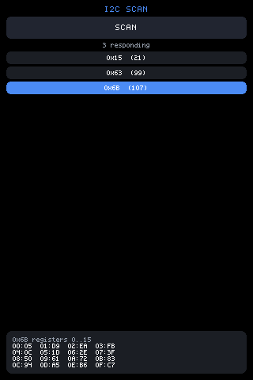

# Hardware access: sys.gpio, sys.i2c and net.fetch

Two natives give a script direct hardware access on the ESP32 bridge
firmware, the same way `sys.store`/`sys.fetch` do: a C function in the
firmware's `natives.h`, a thin wrapper in `glue.c`, an entry in the
generated stdlib table. Other backends (browser, sim, terminal, pure-js)
do not have them — check before calling, the way `examples/gpio` and
`examples/i2c` do:

```js
var HAVE = typeof sys !== 'undefined' && typeof sys.gpio === 'function';
```

## sys.gpio(pin, op, value) -> int

| op | does | returns |
|---|---|---|
| 0 | read: `INPUT_PULLUP`, then `digitalRead` | 0 or 1 |
| 1 | write: `OUTPUT`, then `digitalWrite(value)` | 1 |
| 2 | `analogRead` | the ADC count |

Returns -1 for a refused pin or an unknown op.

Things to know:

- **Reading reconfigures the pin.** op 0 sets `INPUT_PULLUP` every call, so
  polling a pin you just drove releases it. An open pin reads 1, not 0 —
  that is the pullup.
- **The ADC does not reach every pin.** On the ESP32-S3 only GPIO 1..20
  are ADC-capable; op 2 elsewhere reads nothing useful.


## sys.i2c(addr, reg, value) -> int

One byte of a device on the board's shared I2C bus. `value` omitted or
negative reads (write `reg`, repeated-start, read one byte); `value` 0..255
writes that byte. Returns the byte read, 1 on a good write, -1 on no
answer or a bad address (accepted range 0x03..0x77). It is the same Wire
sequence as the bridge's `reg` TCP command, which is the bring-up tool it
mirrors.

The bus is the one the touch controller lives on, and on some boards much
more: the 3.5" board's I/O expander, power-management chip, RTC, IMU and
audio codec all share it. A read is usually harmless (though some devices
clear interrupt flags on read); a stray register write to the PMU is not.
Scan first, write only registers you know.

`examples/i2c` is that advice as a program: it walks 0x08..0x77 a few
addresses per tick so the UI stays live, lists what answered, and peeks
registers 0..15 of whichever address you tap.




## net.fetch(url, opts) -> int

HTTP from a script, on a budget. Present on the bridge firmware alongside
the other `net.*` natives; check for it the same way:

```js
var HAVE = typeof net !== 'undefined' && typeof net.fetch === 'function';
```

Three calls, async in the same style as `net.scan`/`net.results` — nothing
blocks the frame:

| Call | Does |
|---|---|
| `net.fetch(url, opts)` | Starts a request. **1** accepted, **0** busy, **-1** refused. Returns immediately; the transfer runs on its own task. |
| `net.fetchState()` | `''` while in flight, else one JSON line: `{status, date, bytes, truncated, error}`. |
| `net.fetchBody()` | The body as a string, unescaped. Empty after a `HEAD`. |

`opts` is optional: `{head: 1}` sends `HEAD` instead of `GET`, `{max: N}`
caps the bytes kept.

**The body is not in `fetchState()`.** JSON-escaping 32K of arbitrary bytes
is up to 192K of `\uXXXX` — exactly the allocation this native exists to
avoid — so the metadata line stays small and the body has its own accessor.
A caller that only wants the status, or the time, never materialises it.

### It is sandboxed, and off by default

An empty allowlist refuses everything, so pushing a script to a board does
not turn the board into an open proxy. The allowlist is one NVS string,
readable and writable as ordinary config:

```js
configStorage.set('netfetch', 'example.com,api.local');  /* or '*' */
```

A refused call returns -1 and reports `"error":"not allowed"`.

### Why the caps are what they are

A response body becomes a JS string in the engine's heap, and the round
1.28" board is an S3R2 with **2 MB** of PSRAM. So:

- `max` is enforced **while reading**, never "buffer then check" — over the
  cap the rest is drained and dropped, and `truncated` says so. A 4 MB body
  costs the same as a 4 KB one.
- a declared `Content-Length` over `max` is refused **before the body is
  read at all**.
- the ceiling is **32 KB with PSRAM, 8 KB without**, and the buffer is
  allocated in PSRAM when there is any — internal RAM belongs to WiFi.
- **one request in flight.** A second call gets 0. A queue is an unbounded
  allocation wearing a hat.

### Asking the time without a body

Every HTTP response carries a `Date` header (RFC 9110), so a `HEAD` is a
timestamp for the price of the headers — no body, no parse, no JSON. The
status does not even matter: a 301 or a 403 carries the time as well as a
200 does. `examples/clock` reads it exactly this way:

```js
net.fetch('http://example.com/', { head: 1 });   /* later, on a tick: */
var st = JSON.parse(net.fetchState());           /* '' until it lands */
```

Note the endpoint must be **plain http** — there is no TLS client here, and
an https-only host reports `connection lost`.

For setting a fleet's clocks from a machine that already knows the time,
`mjsx clock set` is better than any of this: see [devices.md](devices.md).

## Safety rules

The firmware refuses, with -1, any `sys.gpio` pin the active board's
display or touch controller uses — the denylist is built from the same
`config.h` defines that wire those peripherals, so it tracks the board the
build is for. A script poking the panel's DC line mid-frame rewrites the
display's command state; that class of accident is fenced off rather than
trusted away.

The denylist covers display and touch only. Reader UART pins are **not**
refused — on a board with PN532s attached, driving those pins disturbs the
readers.

## Board pin notes

Refused pins (display + touch) and what else is spoken for, per board:

- **1.69" 240x280 (BOARD 1)**: refused 4, 5, 6, 7, 8, 15 (panel) and
  10, 11, 13, 14 (touch). Reader UARTs sit on 17/18, 2/3 and 43/44.
- **3.5" 320x480 (BOARD 2)**: refused 1, 2, 3, 5, 6 (panel) and 7, 8
  (the shared I2C bus). Readers on 44/43, 15/16, 13/14; SD on 9/10/11;
  the camera owns 17, 18, 21 and 38..48.
- **1.47" 172x320 (BOARD 3)**: refused 21, 38, 39, 40, 45, 46 (panel)
  and 41, 42, 47, 48 (touch). Reader UART on 43/44; 17/18 are SD data
  lines, not spare.
- **round 1.28" 240x240 (BOARD 4)**: refused 2, 8, 9, 10, 11, 14 (panel)
  and 5, 6, 7, 13 (touch). The SH1.0 header brings out 15, 16, 17, 18,
  21, 33; the single reader uses 17/18.

## Not exposed: serial/UART

There is no `sys.uart`. The board's UARTs belong to the PN532 readers
today, routed through the GPIO matrix to the pins listed above, and a
script sharing them would corrupt reader frames. Exposing a UART on a
build that gives up a reader slot is future work.
