# Designing for round glass

The round board is a 240x240 GC9A01 panel with the corners missing. Almost
everything else in mjsx ignores that; a handful of things must not. This
page is the list of things that must not, each with the picture of what
goes wrong or right.

The rule underneath all of it: **an app does not branch on the board.** It
asks the shape one question, `UI.isRound()`, and the layout primitives
handle the rest. The page below is the same source on both shapes.

- [One page, two shapes](#one-page-two-shapes)
- [Asking the shape: `UI.isRound()`](#asking-the-shape-uiisround)
- [The safe rect: holding the flow inside the circle](#the-safe-rect-holding-the-flow-inside-the-circle)
- [The chord: how wide the glass is at a given height](#the-chord-how-wide-the-glass-is-at-a-given-height)
- [Chord-fitted rows vs one uniform width](#chord-fitted-rows-vs-one-uniform-width)
- [ArcFooter: controls along the rim](#arcfooter-controls-along-the-rim)
- [The end margin: a quarter screen of overscroll](#the-end-margin-a-quarter-screen-of-overscroll)
- [The edge-back swipe](#the-edge-back-swipe)
- [Where controls go](#where-controls-go)
- [What to check on a round build](#what-to-check-on-a-round-build)

## One page, two shapes

One list, one footer, one source file. The shot script runs it unchanged
on the 3.5" rectangle and on the round 1.28".

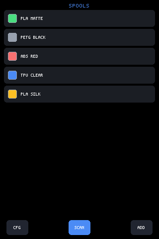

*Square glass: the rows run full-bleed to the panel edges and the footer's
three buttons flatten onto the bottom edge.*

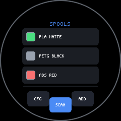

*The same source on round glass: `UI.safe.inset` pulls every row inside
the chord, the footer's buttons follow the rim instead of a straight edge,
and the corners stay empty because there are no corners.*

The whole of the shape-awareness is the first three lines
(`scripts/shoot.mjs`, `SHAPE_PAGE` — the page these two shots run):

```js
UI.safe = UI.isRound()
  ? { top: 36, left: 36, right: 36, bottom: 60, inset: true }
  : { top: 0, left: 0, right: 0, bottom: 44, inset: true };
UI.mount(function () {
  var rows = [];
  var names = ['PLA MATTE', 'PETG BLACK', 'ABS RED', 'TPU CLEAR', 'PLA SILK'];
  for (var i = 0; i < names.length; i++) {
    rows.push(h('row', { bg: UI.theme.panel, radius: 6, pad: 8, gap: 8, h: 34 }, [
      h(Swatch, { color: [0x4ade80, 0x98a1ae, 0xf87171, 0x4b8bf5, 0xfbbf24][i],
                  size: 18, w: 18 }),
      h('text', { text: names[i], size: 1, middle: true })
    ]));
  }
  return h('box', { h: gfx.height(), pad: em(1), gap: em(0.5) }, [
    h('text', { text: 'SPOOLS', size: 2, align: 'center', color: UI.theme.accent }),
    h('box', { flex: 1, scroll: 'spools', gap: 4 }, rows),
    h(ArcFooter, { items: [ /* three 44x30 buttons */ ], at: 90, spread: 60 })
  ]);
});
```

Nothing below that ternary asks what the glass is.

## Asking the shape: `UI.isRound()`

The app does not measure the panel and guess. **The host declares it**, and
the answer never changes while the process runs, so the core reads it once
and caches (`packages/core/src/mjsx.js`):

```js
isRound: function () {
  if (this._round === undefined) {
    this._round = configStorage.get('round', '0') === '1';
  }
  return this._round;
},
```

The channel is `configStorage`'s `'round'` key, and the firmware seeds it
at boot before any script can read it — the round build compiles with
`ROUND_DISPLAY`, so the board knows what it is and the bundle never has to
(`filament-rfid-bridge.ino`):

```cpp
#if defined(ROUND_DISPLAY) && ROUND_DISPLAY
  {
    // The bundle asks configStorage whether the glass is round; the
    // host answers once, through the same store (UI.isRound()).
    Preferences pf;
    pf.begin("jsapp", false);
    if (pf.getString("round", "") != "1") pf.putString("round", "1");
    pf.end();
  }
#endif
```

Web, sim and terminal hosts leave the key unset, so `isRound()` is false
and the default `'0'` does the right thing. The headless shot renderer
seeds it the same way the firmware does (`backend.sys.store('round', '1')`
on a round profile), which is why the round pictures on this page are
produced by the same code path a board runs.

## The safe rect: holding the flow inside the circle

`UI.safe = { top, left, bottom, right, inset }` marks edge bands. With
`inset: true` the *layout* is held inside the safe rect while the
background still paints full-bleed, and touches in the band snap to the
content edge. That is the one mechanism that keeps ordinary rectangular
rows on round glass — see [`ui.md`](./ui.md) for the general contract.

The numbers are geometry, not taste. On the 240px circle, a 36px inset on
three sides leaves a 168px-wide band; its top corners sit
`sqrt(84² + 84²) = 118.8px` from centre, inside the 120px radius, so the
whole rectangle is on the glass. The bottom band is 60px instead of 36
because the footer lives there.

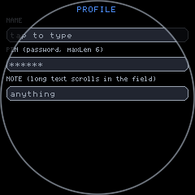

*A field page on round glass. The insets hold the controls in the
rectangle the circle contains; the dark corners are the area the layout is
deliberately refusing to use.*

Text metrics need no round-specific handling at all — `em()` follows the
picked font face, so a page written once relays out for the smaller panel
with no size in the source changing:

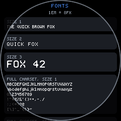

*The same font page as the square shots, on the circle: spacing scales
from the face rather than from a hardcoded pixel count.*

Modals get it for free, because their margins are minimums rather than
fixed offsets:

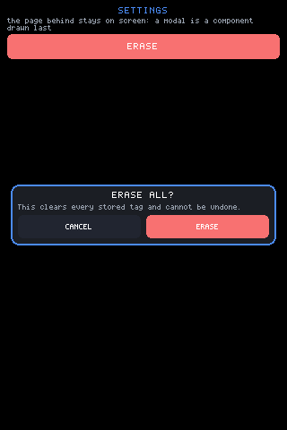

*Square: the panel centres in the leftover space, header and footer rows
sticky.*

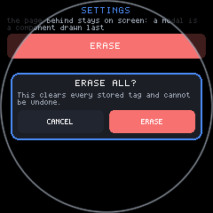

*Round: the same call, the same component. Because the margins are
minimums the panel simply keeps further clear of the rim.*

## The chord: how wide the glass is at a given height

A circle's width depends on where you measure. `gfx.width()` is 240 on the
round board, and that number is only true across the exact middle. Any row
that is not in the middle has less. The core computes the real number —
half the chord across a horizontal band, taking whichever of the two edges
is farther from centre, minus a hair for the bezel:

```js
function kbChordHW(yTop, yBot) {
  var c = gfx.height() / 2, r = c - 2;
  var a = yTop < c ? c - yTop : yTop - c;
  var b = yBot < c ? c - yBot : yBot - c;
  if (b > a) a = b;
  if (a >= r) return 0;
  return Math.floor(Math.sqrt(r * r - a * a)) - 3;
}
```

Two places in the core use it, and both are worth copying.

**One: deciding what fits.** The keyboard's `auto` layout picks by width,
and the width it asks about is the chord down where the bottom rows sit,
not the bounding box:

```js
if (UI.isRound()) kbW = kbChordHW(gfx.height() * 0.72, gfx.height() * 0.86) * 2;
```

On the 240px circle that band is 154px across, not 240. QWERTY wants ~220,
T9 wants ~115, so the honest measurement picks T9 and the naive one would
have picked a QWERTY whose outer columns were under the bezel.


*`auto` on round glass resolves to T9: measured against the chord where
the keys actually land, ten columns do not fit and four do. Note also that
the panel has taken the whole display and every row is inset differently.*

**Two: shaping each row.** `kbRoundRow` insets a row to the chord at its
own height, so a round keyboard is a **trapezoid** — the bottom row is
narrowest because it is nearest the rim, which is exactly where an un-inset
layout puts the space bar and OK.

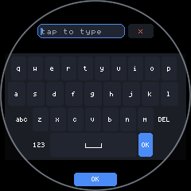

*A named layout is honoured exactly, however cramped — but each row is
still inset to its own chord. Look at the left and right edges stepping
inward row by row: that is the trapezoid.*


*T9 with the same row insets, and OK moved down into the bottom arc —
space a full-width row could never have used.*

The exception proves the mechanism. A keyboard that stays **docked** is not
chord-inset, because a docked panel is a screen-edge overlay:

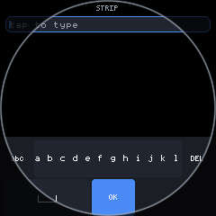

*STRIP's two rows are tall enough to stay docked, and a docked panel gets
no chord inset — so its side keys run under the rim. The four-row layouts
go full-display and inset instead.*

## Chord-fitted rows vs one uniform width

The keyboard fits every row to its own chord. **Lists should not.** The
keyboard is a grid of keys where each row is visibly its own object and a
stepped edge reads as shape; a list of rows is meant to read as one column,
and per-row widths make that column look like it is wobbling as it scrolls.

So content pages take a single uniform inset that the whole circle
contains — the safe rect above — and let the corners go unused. The
sensors example states it in one line
(`examples/sensors/app.jsx`):

```js
/* Round glass gets a uniform inset that keeps every panel inside the
   circle. The SHORT labels are a question of width, not shape: the
   1.47" is a perfectly square 172px panel and truncates
   "acceleration" just as readily as the circle does. */
var round = UI.isRound();
var narrow = round || gfx.width() < 200;
```


*Uniform inset: every panel shares one width, so the stack reads as a
column. Compare the stepped edges of the keyboard shots above.*

The second half of that comment is the other half of the lesson. **Narrow
is not the same question as round.** Label truncation is a width problem,
and the 172px 1.47" rectangle hits it just as hard as the circle, so the
example gates short labels on `round || gfx.width() < 200` rather than on
shape alone:

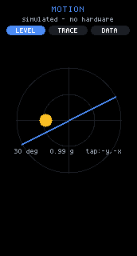

*The narrow rectangle takes the same short labels the circle does — the
condition that chose them was width, not roundness.*

## ArcFooter: controls along the rim

`ArcFooter` places finished items where the ray from screen-centre at each
item's angle meets the boundary, pulled inward by the item's own size. On
round glass the boundary is the rim; on square glass it is the rectangle's
perimeter. One call serves both:

```js
var round = UI.isRound();
var inset = p.inset === undefined ? (round ? 10 : 8) : p.inset;
var spread = (p.spread || 120) * Math.PI / 180;
var a0 = (p.at === undefined ? 90 : p.at) * Math.PI / 180 - spread / 2;
/* ...then, per item, at angle `ang` along the sweep: */
var c = Math.cos(ang), s = Math.sin(ang);
var d;
if (round) {
  var big = items[i].w > items[i].h ? items[i].w : items[i].h;
  d = H / 2 - inset - big / 2;
} else {
  var hx = W / 2 - inset - items[i].w / 2;
  var hy = H / 2 - inset - items[i].h / 2;
  var tx = c < 0 ? -hx / c : (c > 0 ? hx / c : 1e9);
  var ty = s < 0 ? -hy / s : (s > 0 ? hy / s : 1e9);
  d = tx < ty ? tx : ty;
}
```

Props: `items` (`[{ w, h, node }]` — finished elements, `w`/`h` centre each
on its boundary point without measuring), `at` (centre angle, 90 = bottom
and the default, 270 = top), `spread` (total sweep, default 120), `inset`
(margin from the boundary, default 10 round / 8 square). Full prop notes
live in [`components.md`](./components.md).

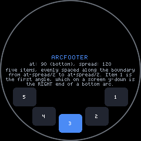

*Five items on the bottom arc, each pulled in from the rim by its own
size. Every item is upright.*

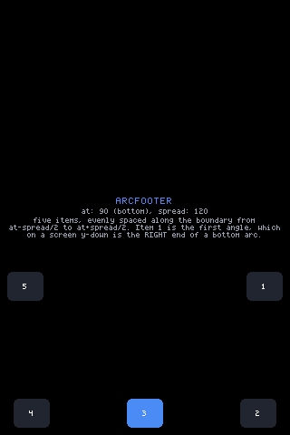

*The identical call on a rectangle: the boundary is the perimeter, so the
arc flattens into the bottom edge and a wide spread walks the end items
around the corners onto the sides.*

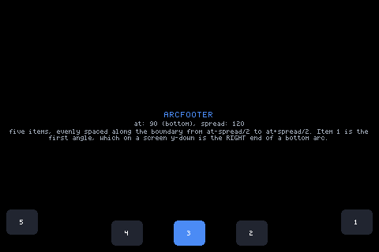

*And again on a landscape window — same source, same three properties.*

Two rules the pictures make concrete:

- **Items stay upright. Text is never rotated.** Only positions follow the
  edge. Rotated glyphs are neither drawable by the text primitive nor
  readable at these sizes.
- **Put wide items mid-list.** The boundary is most generous near the
  centre angle; angles that cluster at a square's corner can overlap, so
  keep `spread` and item count sane, and check the square shot as well as
  the round one.

An arc footer is also how a round app buys back the screen a toolbar would
have cost. `examples/draw/app.jsx` moves its whole toolbar to the rim when
the glass is round:

```jsx
if (UI.isRound()) {
  var items = [];
  items.push({ w: 38, h: 22, node:
    <Button label={tool.toUpperCase()} size={1} pad={em(0.25)} h={22} w={38}
            bg={0x2e4a37} color={0x9fe8b9}
            onTap={function () { /* cycle the tool */ }} /> });
  // ... the colour swatches climb the rim from there
}
```

## The end margin: a quarter screen of overscroll

The bottom arc is the narrowest part of the display, and it is where the
last row of any list ends up. So every scroll zone on round glass gets a
quarter-screen of extra range, **unconditionally**:

```js
/* Round glass: a quarter-screen of extra range, UNCONDITIONALLY,
   so the last rows can be lifted out of the narrow bottom arc
   into the wide middle. Content that FITS the square still
   drowns in the circle — a zone whose maxOff computed to zero is
   exactly the one whose bottom row is stuck in the arc. */
if (UI.isRound()) maxOff += gfx.height() >> 2;
```

On the 240px panel that is 60px of overscroll. The "unconditionally" is
load-bearing: the zone that most needs the margin is the short one whose
content already fits, because its `maxOff` is zero and without this line it
cannot be scrolled at all — leaving its last row parked in the arc
permanently.

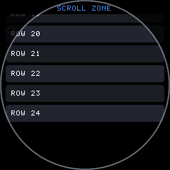

*Scrolled to the end on round glass: the content has travelled past its
natural stop, lifting the final rows out of the bottom arc into the wide
middle.*

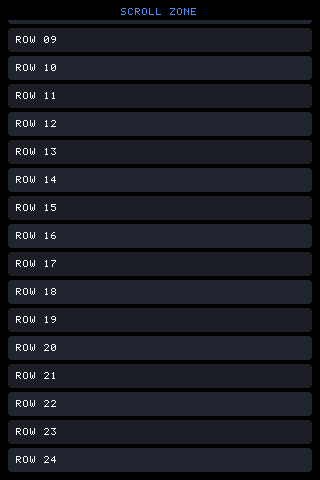

*The same zone on square glass, for comparison: the last row stops flush
at the bottom edge with no extra margin, because none is needed.*

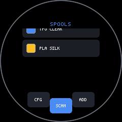

*The end margin in a real page: the bottom of the list is readable in the
middle of the circle rather than crushed against the rim.*

`UI._scrollTo` clamps to the same `maxOff`, so programmatic scrolls,
flings, and `scrollBy` all inherit the margin — round overscroll is baked
into the zone's limit rather than applied at each call site.

## The edge-back swipe

Round glass has no corner to put a close button in. Rather than spend rim
space on one, the core makes an inward swipe from either rim send Escape —
the same key the BOOT button sends, so an app that already handles hardware
back needs no round-specific code.

Arming, at press time:

```js
/* EDGE-BACK: a press at the left or right rim arms the gesture;
   travelling inward turns the stroke into Escape. +1 = inward is
   rightward, -1 leftward, 0 = not an edge press. */
eb: x < 12 ? 1 : (x > gfx.width() - 12 ? -1 : 0)
```

Firing, on move:

```js
if (p.eb && !p.fired) {
  var inw = dx * p.eb;
  if (inw > 40 && (dy < 0 ? -dy : dy) < 60) {
    p.fired = 1;
    p.key = null;
    this.key('press', 'Escape');
    return;
  }
}
```

The thresholds: the press must start within 12px of a side, travel more
than 40px inward, and stay within 60px vertically. It is not round-only —
every screen gets it — and drawing surfaces never see it, because a canvas
that has taken the stroke owns it before this code is reached.

## Where controls go

**OK goes in the bottom arc.** Below the last key row of a full-display
keyboard there is a sliver of glass too narrow for a full-width row and
perfectly sized for one button. Every layout but `strip` parks OK there,
and caps its width to the chord it actually has:

```js
var okInArc = UI.isRound() && layout !== 'strip' && !!UI._exclusive;
...
var okW2 = Math.min(kbChordHW(okTop, okTop + okH2) * 2, em(10));
```

Because the arc was unusable space, moving OK there costs the key grid no
height at all.

Note the `UI._exclusive` term: **only the full-display view draws that
arc**, so only it may take OK out of the rows. The flag does both jobs, and
deciding it from the shape alone — before the auto-exclusive rule has even
run — left a *docked* round T9 with no OK key anywhere: dropped from the
row, and no arc to put it in.

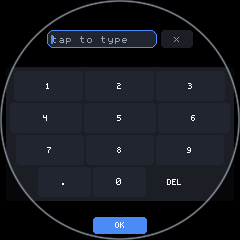

*The number pad full-display, rows inset to their chords, OK sitting alone
in the bottom arc under them.*

The mirrored input in exclusive mode gets the same treatment from the other
end — it is pushed a tenth of the display down, off the narrow top arc,
where at `y = 0` the chord is nearly nothing.

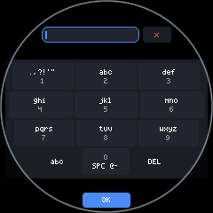

*A real app hitting all of it at once: `examples/wifi` asks for a keyboard
with no layout named, and on this glass that resolves to T9, takes the full
display, and mirrors the password field above the keys.*

**Everything else goes on an arc.** `at: 90` is the bottom arc (the
default), `at: 270` the top. Buttons need no round variant to sit there:

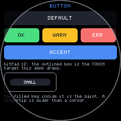

*The standard `Button` on round glass — the same component, the same
`hitPad` growing the touch target past the paint.*

**Exit is the edge-back swipe**, not a control. That is the trade the
section above buys: no rim space spent on a close affordance, and the
gesture works identically on the boards that do have corners.

## What to check on a round build

| Check | Where it bites | Section |
|---|---|---|
| Does the page set `UI.safe` with `inset: true`? | Rows run under the rim | [safe rect](#the-safe-rect-holding-the-flow-inside-the-circle) |
| Did you measure width with `gfx.width()`? | It is only true across the middle | [chord](#the-chord-how-wide-the-glass-is-at-a-given-height) |
| Do list rows share one width? | Per-row insets read as wobble | [uniform width](#chord-fitted-rows-vs-one-uniform-width) |
| Can the last row be scrolled clear of the arc? | Short lists, `maxOff` of zero | [end margin](#the-end-margin-a-quarter-screen-of-overscroll) |
| Is there a way out without a corner button? | Exit affordance | [edge-back](#the-edge-back-swipe) |
| Does the same source still look right square? | Round-only branches drift | [one page, two shapes](#one-page-two-shapes) |

That last row is the one that catches most regressions. Every round shot on
this page has a square counterpart generated from identical source, and
that is the point: round is a shape the layout absorbs, not a fork of the
app.

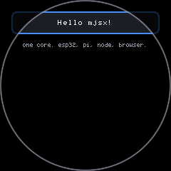

*The smallest example, unmodified, on the circle — the baseline that
everything above is protecting.*

Related: [`ui.md`](./ui.md) for `UI.safe` and scroll zones,
[`components.md`](./components.md) for `ArcFooter` and `Keyboard` props,
[`devices.md`](./devices.md) for the round board's flashing quirks.
