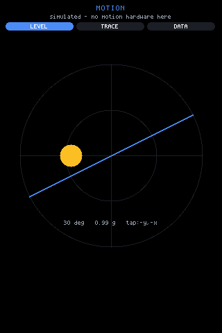
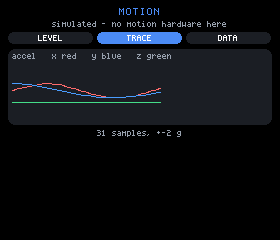
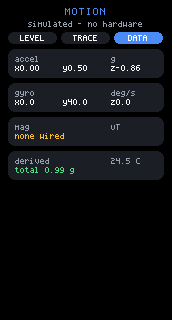
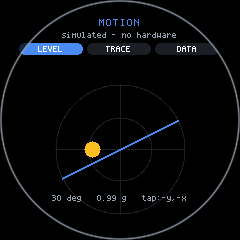
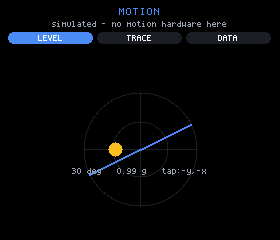
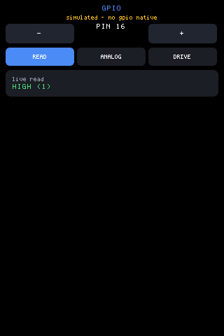
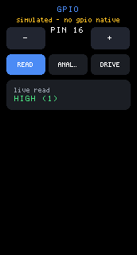

# Motion sensors

The ESP32 bridge firmware carries a motion module: the QMI8658 the
Waveshare boards have on their shared I2C bus, plus whatever magnetometer
happens to be wired to it. A script starts it with one call and then does
nothing but render state.

This page is the reference for that module — how the subscription works,
what the readings mean, and which of the four boards actually has the part.
For the lower-level `sys.gpio` / `sys.i2c` contract see
[`hardware-api.md`](./hardware-api.md); this page cross-references it
rather than repeating it.

- [Starting the module](#starting-the-module)
- [The subscription: patches, not polling](#the-subscription-patches-not-polling)
- [The shape of a patch](#the-shape-of-a-patch)
- [What the fleet actually carries](#what-the-fleet-actually-carries)
- [Ranges and scale factors](#ranges-and-scale-factors)
- [The magnetometer layer](#the-magnetometer-layer)
- [Axes are not the display's axes](#axes-are-not-the-displays-axes)
- [Developing with no hardware](#developing-with-no-hardware)
- [Raw pins and raw bus](#raw-pins-and-raw-bus)



*`examples/sensors` on the 3.5" panel: three views of the same state —
LEVEL, TRACE, DATA. The line under the title names the part that answered,
or says plainly that the reading is simulated.*

## Starting the module

Modules are a runtime registry. What is *compiled in* is decided by build
flags; what is *running* is decided by JS. `sys.mods()` lists them,
`sys.modCtl(name, action)` starts and stops them
(`backends/esp32/firmware/mjsx-board/modules.h`).

The IMU is registered **not running** — starting a sensor is the script's
call, not the firmware's (`mod_wiring.h`):

```cpp
modRegister("imu", false, imuStart, imuStop, imuTick, imuStatus);
```

So the app's opening line is a start, guarded like every other native:

```js
var HAVE_IMU = typeof sys !== 'undefined' && typeof sys.modCtl === 'function' &&
               sys.modCtl('imu', 'start') === 1;
```

`sys.modCtl` returns **1 accepted, 0 unknown or failed**, and it is
asynchronous: acceptance is immediate, readings arrive later as state
patches. Starting an already-running module is 1, not an error. An unknown
name is 0. `imuStart()` probes for the chip and returns false when there is
nothing there, so a 0 on the 1.47" board is the honest answer rather than a
silent no-op:

```cpp
static bool imuStart() {
  const uint8_t tryAddr[2] = { 0x6B, 0x6A };
  g_imuAddr = 0;
  for (int a = 0; a < 2; a++) {
    uint8_t who = 0;
    if (i2cRd(tryAddr[a], 0x00, &who, 1) == 1 && who == 0x05) {
      g_imuAddr = tryAddr[a];
      imuWr(0x02, 0x40);  // CTRL1: address auto-increment
      imuWr(0x03, 0x04);  // CTRL2: accel +-2g, 250Hz
      imuWr(0x04, 0x54);  // CTRL3: gyro +-512dps, 250Hz
      imuWr(0x08, 0x03);  // CTRL7: accel + gyro enable
      break;
    }
  }
  magStart();
  return g_imuAddr != 0 || g_magAddr != 0;
}
```

Note the last two lines: the magnetometer is probed independently, so a
board with a wired mag and no IMU still starts. Stop when the view goes
away, or the module keeps reading for nobody:

```js
UI.onCleanup(function () {
  if (HAVE_IMU) sys.modCtl('imu', 'stop');
});
```

`sys.mods()` returns the registry as JSON including each module's status
body, which is how a page can name the part instead of guessing:

```js
/* What the module found, so the page can name the part rather than
   guessing: {"addr":107,"imu":"QMI8658","mag":"none",...} */
var INFO = {};
if (HAVE_IMU && typeof sys.mods === 'function') {
  var raw = sys.mods();
  if (raw && raw.indexOf('QMI8658') >= 0) INFO.imu = 'QMI8658';
  var MAGS = ['QMC5883L', 'HMC5883L', 'LIS3MDL', 'MLX90393'];
  for (var mi = 0; mi < MAGS.length; mi++) {
    if (raw && raw.indexOf(MAGS[mi]) >= 0) { INFO.mag = MAGS[mi]; break; }
  }
}
```

## The subscription: patches, not polling

There is no read call. The module's `tick()` runs on the firmware's loop,
and when a reading has **moved** it pushes a state patch through the same
queue the printer feed uses — `UI.patch` into `UI.state`. The app
subscribes by rendering from state and is redrawn when state changes.

```
sys.modCtl('imu','start')  ->  imuTick() every loop
                               reading moved?  -> jsQueueState(json)
                                                    -> UI.state.accel
                                                    -> re-render
```

Two gates keep an idle board from becoming a message pump. A 100ms floor:

```cpp
if ((!g_imuAddr && !g_magAddr) || millis() - lastAt < 100) return;
```

and a per-signal movement threshold, compared against the last value sent:

```cpp
/* Patch only on real movement, per signal: ~0.02g, ~2dps, 0.5C.
   An idle board should not be a message pump. */
if (abs(ax - lA[0]) >= 320 || abs(ay - lA[1]) >= 320 || abs(az - lA[2]) >= 320) {
```

| Signal | Raw threshold | In units |
|---|---|---|
| accel | 320 LSB | ~0.02 g |
| gyro | 128 LSB | 2 deg/s |
| temp | 0.5 | 0.5 C |
| mag | squared delta > 1.0 | ~1 uT |

The patch carries **only the signals that moved** — an object with `accel`
alone is normal, and code must not assume `gyro` is present in the same
patch. If nothing moved, nothing is sent at all.

This has a consequence worth designing around: **a render is exactly when
new data arrived.** The example's rolling history is therefore fed from the
render rather than from a timer of its own, so the trace advances with the
signal and never depends on two clocks agreeing:

```js
function pushSample(a) {
  /* Fed from the RENDER rather than a timer: a render is exactly when new
     data arrived (the module patches state only when a reading moved), so
     the trace advances with the signal and never depends on a second
     clock agreeing with the first. */
  if (!a || a === hist.last) return;
  hist.last = a;
  hist.x.push(a.x); hist.y.push(a.y); hist.z.push(a.z);
  if (hist.x.length > HIST_N) { hist.x.shift(); hist.y.shift(); hist.z.shift(); }
}
```



*The TRACE view: the last few seconds of each axis as a sparkline, so a tap
or a shake reads as a shape instead of three twitching numbers. x and y are
the two curves, z is the flat line at rest, and the count under the panel
(`31 samples`) is the history advancing by the patches, not by a poll.*

## The shape of a patch

Straight from the module's header, with the units the JS side receives:

```
{"accel":{"x":-0.02,"y":0.98,"z":0.11},        g
 "gyro":{"x":0.4,"y":-1.2,"z":0.0},            degrees/second
 "temp":31.5,                                  celsius
 "mag":{"x":12.4,"y":-30.1,"z":44.0}}          microtesla
```

| Key | Type | Unit | Precision sent |
|---|---|---|---|
| `accel` | `{x, y, z}` | g | 2 decimals |
| `gyro` | `{x, y, z}` | degrees/second | 1 decimal |
| `temp` | number | celsius (die temperature) | 1 decimal |
| `mag` | `{x, y, z}` | microtesla | 1 decimal |

`temp` is the IMU die, not ambient — it reads warm and is useful for drift,
not for room temperature. Reading them is ordinary state:

```js
var a = UI.state.accel || null;
var g = UI.state.gyro || null;
var m = UI.state.mag || null;
var t = UI.state.temp;
var amag = a ? Math.sqrt(a.x * a.x + a.y * a.y + a.z * a.z) : null;
```

Every one of them can be absent, and absence is a normal answer rather than
an error — the example prints what is missing instead of hiding it:

```jsx
{v
  ? <row gap={em(0.5)}>
      <text text={'x' + fmt(v.x, p.d)} size={sz} color={UI.theme.text} />
      <text text={'y' + fmt(v.y, p.d)} size={sz} color={UI.theme.text} />
      <text text={'z' + fmt(v.z, p.d)} size={sz} color={UI.theme.text} />
    </row>
  : <text text={p.absent || 'not present'} size={1} color={UI.theme.warn} />}
```



*The DATA view on the 1.47" board — the one board in the fleet with no
motion sensor at all. The `mag` row reads `none wired` in warn rather than
`x0.0 y0.0 z0.0`, and the header says `simulated - no hardware`: both are
the page stating what is absent rather than showing zeros. (`none wired` is
the short form; a panel 200px or wider gets `no magnetometer wired`.)*

## What the fleet actually carries

Measured by scanning all four boards, recorded in `mod_imu.h`:

| Board | Motion sensor | Also on the bus |
|---|---|---|
| 1.69" 240x280 | QMI8658 at **0x6B** | RTC 0x51 |
| 3.5" 320x480 | QMI8658 at **0x6B** | codec, I/O expander, PMU, touch, RTC |
| 1.28" round 240x240 | QMI8658 at **0x6B** | touch 0x15 |
| 1.47" 172x320 | **none** | — |

Three facts to design against:

- **The 1.47" has no motion sensor.** `imuStart()` says so rather than
  lying, and any app that offers a motion feature needs a path for that
  board. It is not a wiring fault to chase.
- **No board carries a magnetometer.** The whole mag layer below exists for
  a part wired to the exposed pins.
- **0x7E is not a device.** It answers an address scan on three boards but
  no register read; `0x78..0x7F` are reserved I2C addresses, so that is a
  scan artifact.

The probe tries `0x6B` then `0x6A` and confirms with a WHO_AM_I of `0x05`,
so an address hit alone is never taken as a QMI8658.



*The LEVEL view on the round board — gravity as a bubble drifting in rings
with a horizon line tilting by roll. It is the one view a round display
renders better than a rectangle, because a circle is already the frame.*

## Ranges and scale factors

The conversion constants and the control registers are two halves of one
decision. Change a range and you must change its scale factor:

```cpp
#define QMI_ACC_LSB_PER_G   16384.0f   /* CTRL2 +-2g   */
#define QMI_GYR_LSB_PER_DPS 64.0f      /* CTRL3 +-512dps */
```

| Quantity | Register set at start | Full scale | LSB per unit |
|---|---|---|---|
| accel | CTRL2 = `0x04` | ±2 g, 250Hz | 16384 / g |
| gyro | CTRL3 = `0x54` | ±512 deg/s, 250Hz | 64 / (deg/s) |
| temp | — | — | 256 / C |

`CTRL1 = 0x40` turns on address auto-increment, which is what lets the tick
read temperature, accelerometer and gyroscope as a **single 14-byte
transaction** starting at 0x33 rather than three round trips on a bus
shared with the touch controller. `CTRL7 = 0x03` enables both sensors;
`imuStop()` writes `0x00` there.

±2 g is the practical limit to remember: a sharp tap saturates, so a
shake-detector should threshold well below 2 g rather than looking for a
peak it may never see.

## The magnetometer layer

No board in the fleet has one. This exists for a part wired to the exposed
pins — on the round board, for instance, the SH1.0 header brings out
GPIO 15, 16, 17, 18, 21 and 33 (see
[`hardware-api.md`](./hardware-api.md#board-pin-notes)).

Four parts are recognised, identified by WHO_AM_I where the part has one,
put into continuous mode, then read as six little-endian bytes. Each scale
converts that part's LSB to microtesla, so the JS side never learns which
chip answered:

| Part | Address | Identified by | Scale to uT |
|---|---|---|---|
| QMC5883L | 0x0D | no reliable WHO_AM_I; register probe | 100 / 12000 (8G) |
| HMC5883L | 0x1E | ident register A reads `'H'` | 100 / 1090 |
| LIS3MDL | 0x1C or 0x1E | WHO_AM_I 0x0F = `0x3D` | 100 / 6842 |
| MLX90393 | 0x0C..0x0F | accepts the burst-start command | 0.150 uT/LSB |

Byte order differs per part and is handled in `magRead` — MLX90393 is
big-endian and command-driven rather than a register file, HMC5883L returns
X, Z, Y in that order, the other two are plain little-endian XYZ.

**Detection is real; the scaling is not verified against hardware.** The
scale factors come from each datasheet and have never been checked against
a physical part, because no such part has been attached. Treat mag readings
as correctly *shaped* and provisionally *scaled*: directions and relative
changes are trustworthy, absolute microtesla values are not, until someone
wires a part and calibrates.

## Axes are not the display's axes

The chip's X/Y/Z have no fixed relationship to the screen's. Which way the
part is rotated against the glass differs per board, and again per display
rotation, so there is no single correct mapping to hardcode. The example
does not try — it offers all eight and lets a tap choose:

```js
var MAPS = [
  { n: 'x,y',   f: function (a) { return { x:  a.x, y:  a.y }; } },
  { n: 'x,-y',  f: function (a) { return { x:  a.x, y: -a.y }; } },
  { n: '-x,y',  f: function (a) { return { x: -a.x, y:  a.y }; } },
  { n: '-x,-y', f: function (a) { return { x: -a.x, y: -a.y }; } },
  { n: 'y,x',   f: function (a) { return { x:  a.y, y:  a.x }; } },
  { n: 'y,-x',  f: function (a) { return { x:  a.y, y: -a.x }; } },
  { n: '-y,x',  f: function (a) { return { x: -a.y, y:  a.x }; } },
  { n: '-y,-x', f: function (a) { return { x: -a.y, y: -a.x }; } }
];
```

The default was measured on the glass, not derived:

```js
/* Measured on the glass, not derived: the chip's X and Y are SWAPPED
   relative to the display. A flat board reads z = -1g so +Z points into
   the glass, and with the axes crossed that puts the chip's +X along the
   screen's vertical and +Y along its horizontal -- so the screen's x
   comes from -a.y and its y from -a.x. Boards whose chip sits rotated
   differently are one tap on the dial away. */
var MAP_DEFAULT = 7;   /* '-y,-x' */
```

The choice persists per host in `configStorage`, so calibrating a board is
a one-time act rather than a startup ritual:

```js
kids.push(h('box', {
  h: dial, onTap: function () {
    configStorage.set('lvl.map', '' + ((mapIdx() + 1) % MAPS.length));
    UI._dirty = true;
  }
}, levelNodes(a, cx, cy, R)));
```



*The LEVEL view, and the mapping made visible: the footer's `tap:-y,-x`
names the entry currently chosen out of `MAPS` — `MAP_DEFAULT = 7` — so
the reading that produced the bubble and the tilted horizon can be checked
against the axes it was drawn from. Tapping the dial advances to the next
one and writes it to `configStorage`.*

The other trap in that view is a layout one, and it is general: **`abs` is
page-absolute, not parent-relative.** A dial drawn at box coordinates and
"centred" with flex spacers lands wherever the page origin happens to be.
Every coordinate in the level view is computed against `gfx.width()` and
`gfx.height()` directly:

```js
var top = narrow ? 84 : 92;
var dial = Math.min(gfx.width() - (narrow ? 40 : 56),
                    gfx.height() - top - (narrow ? 26 : 34));
if (dial < 50) dial = 50;
var R = dial >> 1;
var cx = gfx.width() >> 1, cy = top + R;
```

Conversely the sparkline uses **no** `abs` at all — `line` and `path`
measure zero height, so as ordinary flow children they draw from their own
box's origin and stack correctly. Reaching for `abs` there painted the
graph over the header.

## Developing with no hardware

No in-tree backend provides `sys.modCtl` (see
[`consistency.md`](./consistency.md)) — it is a device native, and the
browser, sim, terminal and pure-js hosts have none of them. So every
example gates on `typeof sys.x === 'function'` and renders a fallback, and
the sensors example goes one step further: it drives the same state itself,
so the page is developable anywhere.

```js
/* No hardware: drive the same state so the page is developable anywhere.
   Deliberately NOT started when the module is live -- a simulated needle
   next to a real one would be a lie. */
if (!HAVE_IMU) {
  (function tick() {
    var ms = sys.millis();
    UI.set({
      accel: { x: Math.sin(ms / 900) * 0.5, y: Math.cos(ms / 1300) * 0.5, z: -0.86 },
      gyro: { x: Math.sin(ms / 300) * 40, y: Math.cos(ms / 400) * 40, z: 0 },
      temp: 24.5
    });
    UI.setTimer(tick, 200);   /* a real driver re-arms exactly this way */
  })();
}
```

Three things that make this a pattern worth copying rather than a
debug hack:

- The simulator writes to the **same state keys** the module patches, so
  the views have no idea which is running.
- It is **not** started when the module is live. A simulated needle beside
  a real one is a lie, and half-real pages are how bad readings get
  shipped.
- It re-arms with `UI.setTimer` exactly the way a real driver would, so the
  render path being exercised is the production one.

The page also *says* which of the two you are looking at, in the header
line under the title — `INFO.imu + ' + ' + INFO.mag` when live,
`'simulated - no motion hardware here'` when not. Every screenshot on this
page is the simulated path, because it was rendered headless.

## Raw pins and raw bus

Below the module layer, `sys.gpio(pin, op, value)` and
`sys.i2c(addr, reg, value)` give a script direct hardware access. Their
full contract — op codes, return values, the per-board refused-pin lists —
is in [`hardware-api.md`](./hardware-api.md). The rules that matter most
when you are chasing a sensor:

- **Reading a pin reconfigures it.** `op 0` sets `INPUT_PULLUP` on every
  call, so polling a pin you just drove releases it. An open pin reads 1,
  not 0 — that is the pullup, not a signal.
- **The display and touch pins are refused**, with -1, from a denylist
  built out of the same `config.h` defines that wire those peripherals.
  Reader UART pins are **not** refused, and driving them disturbs the
  PN532s.
- **The I2C bus is shared** — with touch, and on the 3.5" board with the
  I/O expander, PMU, RTC and audio codec too. A read is usually harmless,
  though some devices clear interrupt flags on read; a stray register write
  to the PMU is not. **Scan first, write only registers you know.**



*`examples/gpio`: a pin picker, the three ops, and the firmware's refusals
shown rather than hidden. Under the pure-js backend there is no native, so
the app draws a labelled simulated board.*



*The same page on the narrow panel — the simulated board models the 1.69"
denylist, so the refused pins answer -1 exactly as the firmware does.*


*`examples/i2c` with no `sys.i2c` present: the page is its title and one
honest fallback line. On a board it scans 8..119 a few addresses per tick,
so the UI stays live while it walks the bus, and a tap on a responder peeks
registers 0..15.*

The scan's shape is worth borrowing — a missing device NACKs quickly, but
112 probes inside one tap would still stall a frame:

```js
/* A few addresses per tick: a missing device NACKs fast, but 112 probes
   in one tap would still stall a frame noticeably. */
UI.onTick = function () {
  var next = UI.state.next;
  if (!HAVE || next === undefined || next === null) return;
  var found = UI.state.found || [];
  var stop = next + 8;
  for (; next < stop && next <= 119; next++) {
    if (sys.i2c(next, 0) >= 0) found = found.concat([next]);
  }
  UI.set({ found: found, next: next > 119 ? null : next });
};
```


*The same near-blank fallback frame on the narrow panel. A page that has
nothing to report says so.*

Related: [`hardware-api.md`](./hardware-api.md) for the pin and bus
contract, [`devices.md`](./devices.md) for the boards and the push/OTA
loop, [`round.md`](./round.md) for the round board's layout rules.
